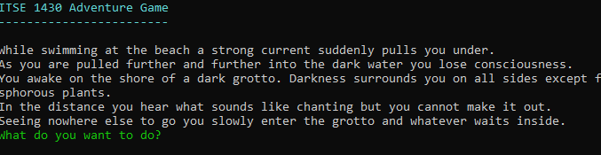
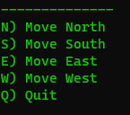
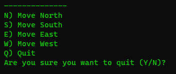
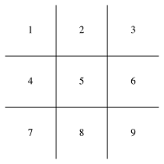
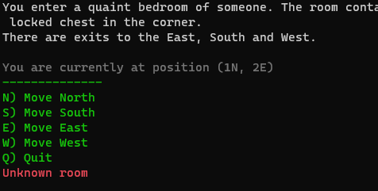
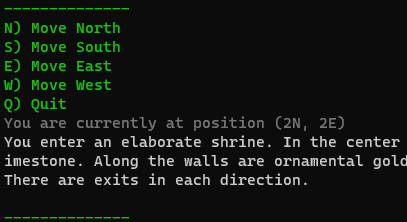

# Adventure Game (Lab 1)
## ITSE 1430

## Version 1.0

In this lab you will create the basic structure for an "adventure game" like program similar to [Zork](https://en.wikipedia.org/wiki/Zork) or other text-based games.

*NOTE: Images are provided to help clarify instructions where needed. They are examples and should not be taken as requirements.*

## Skills Needed

- C#
  - Control flow statements
  - Functions and parameters
  - Types
  - Variables
- Console read/write

## Story 1 - Set Up Project

Create a new Console project to hold your code.

### Description

*NOTE: Since this is the first lab the story goes into more detailed steps than subsequent labs will.*

1. Open Visual Studio.
1. Create a new project by using the `Create a new project` option in the `Start Window`.
   1. Under the languages filter select `C#`. Then search for the template `Console App`.
   1. Select `Console App`. Ensure that the language is shown as `C#` and it includes the tags `C#`, `Linux` and `Windows`. Click `Next`.
   1. Configure project
      1. For the project name use `{Name}.AdventureGame.ConsoleHost`.
      1. Set the solution nanme to `Lab1`.
      1. Ensure the project location is set to the `Labs` folder of your Github repo that you have previously cloned.
      1. Click `Next`.
   1. Set additional information.
      1. Ensure the target framework is set to `.NET 6.0`.
      1. Uncheck the `Do not use top-level statements` option if it is checked.
      1. Click `Create` to create the project.
   1. Click the project in `Solution Explorer` to open it.
      1. Find the line `<nullable>?</nullable>` and set the value to `disable`.
1. Commit the solution to Github and ensure it shows up online in the browser under the `Labs` folder.


Add a file header as discussed in class to the `Program.cs`. Be sure to do this for any additional files you add as part of the assignment.

Commit the solution to Github and ensure it shows up online in the browser under the `Labs` folder.

### Acceptance Criteria

- Solution opens properly in Visual Studio and loads all projects.
- Project is properly named in repository.
- Code compiles cleanly.

## Story 2 - Display Introduction

Display an introduction when the game starts.

### Description

Display an introduction to your game when the program starts.
The introduction should set the stage for the adventure to come.

As part of the introduction include your name, the class name (`ITSE 1430`) and the date you created the program (e.g. `Fall 2023`).



*NOTE: Remember programming fundamentals so use functions to create separate, logical blocks of code.*

### Acceptance Criteria

- Program information is shown when application starts.

## Story 3 - Implement the Game Loop

Implement the core game loop.

### Description

The game loop will consist of prompting the player for input and then responding to that input.
The loop will continue until the player decides to quit.

- During each iteration display a menu of options to the user.
- If the player enters a valid option then perform the requested command (to be implemented later).
- If the player enters an invalid option then display an error and prmopt again.

Some rules on implementation.

- Case does not matter (e.g. `a` and `A` are the same thing).
- Use separate functions to actually handle the commands (e.g. `Move`).
- Do not recursively call the game loop because this will result in a stack overflow.
- Ensure the input displays properly without spelling errors.



### Acceptance Criteria

- Player is continaully prompted for input. At this time there is no way to exit the loop.
- If the player enters an invalid input then display an error.
- If the player enters a valid input then perform the command and prompt again. At this time there is no way to verify this works.

## Story 4 - Support Exiting the Program

Implement the command to exit the program after a confirmation message.

### Description

Add support for exiting the program from the game menu.
It should be the last option in the game menu.

When thee player selects this option prompt them if they are sure.
If they confirm then exit the program otherwise continue normally.



Remember that each function should do one and only one logical operation.
Therefore you should have a separate function for each command you support.

*NOTE: Use a simple confirmation system such as allowing the player to select `Y` or `N`. If the player must enter a letter then the case is insensitive.*

### Acceptance Criteria

- When selected the player is prompted to close the program.
- If the player confirms then exit the program.
- If the player does not confirm then return to the main menu.

## Story 5 - Design the World

Design the world in which the game takes place.

### Description

Create the world in which your game takes place.
There is no coding for this step, just design.
Is your world an alien planet? Undersea cave? Medieval castle? Or perhaps just your house?
It is up to you.

For this game world we will limit the map to a 3x3 grid of rooms but it is recommended you use constants in your code to make it easy to change later.



For each room the player can move to adjoining rooms.
For example if the player is in room 1 then they can move to rooms 2 or 4.
If they are in room 5 then they can move to rooms 2, 4, 6 or 8.
If they are in room 8 then they can move to rooms 5, 7 or 9.

Choose one of the rooms to be the starting room.
Plan out each room.
Be more descriptive than "kitchen", "cave" or "door".

## Story 6 - Support Moving Between Rooms

Add commands to allow moving between rooms.

### Description

Add commands to support moving between rooms.
Since a room may have multiple exits the user must be able to choose the direction to move (e.g. `Move North`, `Move South`),

To implement this story you need to decide how to track player movement.
There are a variety of approaches available but you should implement a simple solution.
Do not create a complex system that supports more features than are needed for this lab as it might conflict with future lab requirements.
You are also not allowed to use any third party system that you might find online.
All code must be your own.
If you need help refer to the end of the lab for one solution.

When a move command is selected then determine what room the player is moving to.
If the player can move in the given direction then do the following:

- Adust the players position to the new room.
- Display the current position of the player.

If the player cannot move in the given direction then display a descriptive message to alert the user.

Remember that you have to determine a starting room.
Ensure whatever player tracking code you write starts in this room.



### Acceptance Criteria

- Player can move between rooms.
- Player cannot move to a room that is not connected to the existing room.
- Player receives a descriptive message when trying to go in a direction that isn't supported.
- Player sees their current position.

## Story 7 - Provide Room Descriptions

Provide a description for each room.

### Description

When the player enters a room display a description of the room based upon your design from the earlier story.
This description should be displayed to the user and should include the exits from the room.
The description is in addition to the position information that is already displayed.



To implement this easily create a separate function for each room.
When the player moves to a room, determine the "room number" by using the current position.
For example, given the tracking system described later the code might look like this.

```csharp
int roomNumber = currentX + (MaximumX * (currentY - 1));

switch (roomNumber)
{
   case 1: Room1(); break;
   case 2: Room2(); break;
   case 3: Room3(); break;
};
```

This solution does not need to be flexible at this point so keep it simple.

*NOTE: Be sure to test your calculations for all rooms. Off by one errors are easy to make here.*

### Acceptance Criteria

- When player enters a room they see a description and position.
- The description correctly indicates the exits from the room.

## Story 8 - Add Random Encounters

To make the game more exciting add a small chance for a random encounter when moving between rooms.

### Description

When the player enters a new room determine if they have an encounter.
The chance for an encounter should be 5% (see below on how to calculate this).

If an encounter occurs then expand the description to include what happens (e.g. `a shadow disappears into another room`, `lightning flashes outside casting an eerie light`).
Nothing else should happen at this point nor does the player need to do anything.

### Generating a percentage

Create a function that calculates a number between 1 and 100, inclusive.
To determine a percentage chance (e.g. `5`) then call the function and determine if the value is less than or equal to the percentage.

```csharp
int GeneratePercentage()
{
    return Random.Shared.Next(1, 101);
}
```

### Acceptance Criteria

- When player enters a room there is a small chance for an encounter.
- The description explains the encounter.

## Implementing a Player Tracking System

If you are unsure how to implement a tracking system then you may consider using the following approach.

Assume a player's position is represented by an XY coordinate.
XY start at (0,0) which is the top left of the grid.
If the player moves right then X increments by 1 while moving left decrements it by 1.
Moving up decrements Y while moving down increments it.
It could be coded using a simple `switch` statement.

```csharp
//Assume current position is x, y
int newX = x, newY = y;
switch(direction)
{
   case up: newY -= 1;
   case down: newY += 1;
   case left: newX -= 1;
   case right: newX += 1;
}
```

Given the new position it may or may not be valid so some checks are needed.
Given a rectangular grid of size MxN then X must be in the range 0 to M while y must be 0 to N.

```csharp
if (x >= 0 && x < MaximumX && y >= 0 && y < MaximumY)
   //Valid move
```

If the movee is valid then the player is moved simply by updating the variable(s) tracking the position.

## General Guidelines

### General

- It is strongly recommended that you complete the stories in order. Some stories rely on the work done in previous stories.
- Commit your changes to Github frequently to ensure you don't lose any work. You do not need to wait for a story to be completed.
- After you implement a story ensure it meets all the acceptance criteria. In some cases a later story may change the behavior of an earlier story.
- After you complete a story you should commit the changes you've made to Github. If something comes up and you are not able to complete the remaining stories you can at least get credit for the work you've done.
- Unless otherwise stated all inputs must be validated to ensure they are of the current type and range as given in the assignment.

### Naming Conventions

- USE descriptive nouns for variable and parameter identifiers (e.g. `payRate`, `name`, `index`).
- USE descriptive verbs for function identifiers (e.g. `GetName`, `ShowProgress`).
- DO NOT use single letters or abbreviations in identifiers (e.g. `x`, `descriptValue`).
- DO ensure spelling for identifiers.
- DO use camel casing for variables, parameters and fields.
- DO use Pascal casing for types and public members.

### Coding Style

- DO put a file header at the top of each file you create. The file header should contain the class, date and your name.

  ```csharp
  /*
   * Your Name
   * ITSE 1430 
   * Lab 1
   */
  ```

- DO use consistent indentation. In general each block indents one time (3 or 4 spaces). Curly braces should be aligned.

  ```csharp
  //NO
  while (someCondition) 
     { 
    Foo();
  }

  //YES
  while (someCondition)
  {
     Foo();
  };
  ```

- DO use a single blank line between blocks of code (e.g. functions, control flow statements, etc).
  
  ```csharp
  //NO
  void DoWork ()
  {
  }
  void DoMoreWork()
  {
  }
  
  //YES
  void DoWork ()
  {
  }
  
  void DoWork ()
  {
  }
  ```

- DO consider declaring variables just before or as part of their first usage instead of up front.

  ```csharp
  //NO
  int hours;
  double payRate, totalPay;
  ...
  totalPay = payRate * hours;
  
  //YES
  double totalPay = payRate * hours;
  ```

- DO put comments above code that is not clear.
- DO NOT put comments in code that repeats what the code does.

  ```csharp
  //NO
  //Loop through stuff
  for (...)
  //YES
  for (...)
  ```

### Lab 1 Adjustments

Because this is lab 1 some adjustments to how C# code is normally written will be observed.

- Any variable that needs to be accessible across function calls will need to be declared outside any function and marked as `static`.

  ```csharp
  void Foo ()
  { 
     id = 1;
  }

  void Bar ()
  {
     if (id > 0)
     { }
  }

  //Outside functions and marked as static
  static int id;
  ```

  NOTE: DO NOT declare all variables this way, only those that are needed across function calls AND using parameters/return type is inefficient.
- Functions need to be marked as `static`.

  ```csharp
  static void Foo () 
  {}

  static void Bar ()
  {}
  ```

## Requirements

- DO ensure code compiles cleanly without warnings or errors (unless otherwise specified).
- DO ensure all acceptance criteria are met.
- DO Ensure each file has a file header indicating the course, your name and date.
- DO ensure you are using the provided `.gitignore` file in your repository.
- DO ensure the entire solution directory is uploaded to Github (except those files excluded by `.gitignore`).
- DO submit your lab in Canvas by providing the link to the Github repository.
